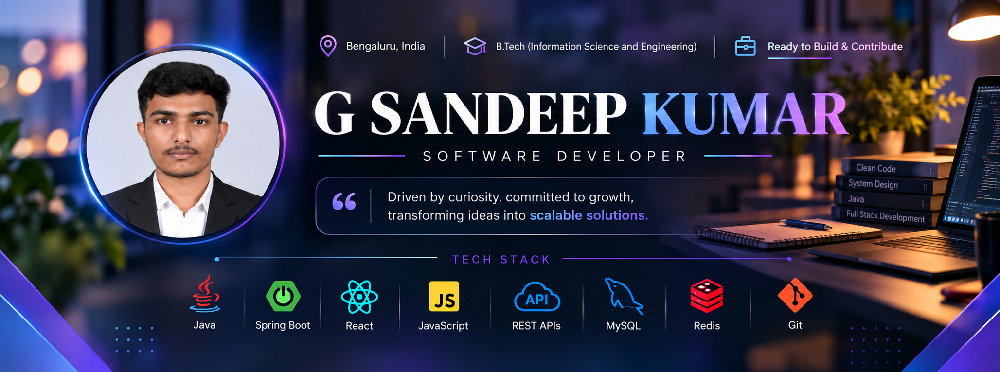

<!-- ========================================================= -->
<!--                         BANNER                            -->
<!-- ========================================================= -->

  

 

<!-- ========================================================= -->
<!--                         INTRO                             -->
<!-- ========================================================= -->

<h1 align="center">Hi 👋, I'm G Sandeep Kumar</h1>

<h3 align="center">
  🚀 Aspiring Software Engineer | Java | Spring Boot | React.js | REST APIs
</h3>

  <em>
    Driven by curiosity, committed to growth, transforming ideas into scalable solutions.
  </em>

# 👨‍💻 About Me

🎓 B.Tech Information Science and Engineering student at
**Jain (Deemed to be University), Bengaluru**.

💻 Aspiring **Software Engineer** with strong foundations in
Java, Data Structures & Algorithms, OOP, DBMS and Computer Networks.

🚀 Experienced in developing applications using
**Spring Boot, REST APIs, MySQL, React.js, HTML, CSS and JavaScript**.

🧠 Solved **300+ DSA problems** with a focus on efficient
problem solving and algorithmic thinking.

💡 Interested in **backend development, full-stack development,
API development and scalable software solutions**.

🤝 **Ready to Build & Contribute.**

---

## 🧰 Tech Stack

**💻 Languages**

**⚙️ Backend**

**🎨 Frontend**

**🗄️ Database**

**🛠️ Tools**

---

# 🚀 Featured Projects

## 🔐 API Rate Limiter

**Java | Backend Development**

A scalable API Rate Limiter developed to manage request traffic
with user-based and API-level access control.

### ✨ Key Highlights

- 🚦 Implemented request throttling mechanisms
- 🔐 User-based and API-level access control
- 📊 API monitoring and request validation
- ⚡ Efficient backend request management
- 🛡️ Protection against excessive requests and API abuse
- 📈 Improved application reliability and resource management

**Tech:** `Java` `REST APIs` `Data Structures` `Backend Development`

---

## 📦 Product Management System

**Spring Boot | REST APIs | MySQL | React.js**

A full-stack product management application built using
Spring Boot, REST APIs, MySQL and React.js.

### ✨ Key Highlights

- 🔄 Developed RESTful APIs for product management
- ➕ Implemented CRUD operations
- 🖼️ Implemented image upload and retrieval
- 📁 Used `MultipartFile` for media handling
- 🔎 Built search and update APIs
- 🧩 Used Jackson `ObjectMapper`
- ✅ Implemented proper HTTP response handling

**Tech:** `Java` `Spring Boot` `REST APIs` `MySQL` `React.js`

---

## 🌐 Personal Portfolio Website

**HTML | CSS | JavaScript**

A responsive personal portfolio website developed to showcase
my professional profile, technical skills and projects.

### ✨ Highlights

- 🎨 Responsive user interface
- 👨‍💻 Professional developer profile
- 📂 Project showcase
- 🛠️ Technical skills section
- ⚡ Interactive frontend components
- 📱 Responsive design

**Tech:** `HTML` `CSS` `JavaScript`

---

## 🛒 E-Commerce Website

**HTML | CSS | JavaScript**

A responsive e-commerce web application developed during my
Frontend Web Development internship.

### ✨ Highlights

- 🛍️ Product listings
- 🧭 Navigation system
- ⚡ Interactive UI components
- 📱 Responsive design
- 💻 JavaScript-based frontend interactions
- 🔧 Git & GitHub version control

**Tech:** `HTML` `CSS` `JavaScript`

---

# 💼 Experience

## 💻 Frontend Web Development Intern — MotionCut

**Jan 2025 – Mar 2025 · Remote · Bengaluru**

Worked on frontend web development projects focused on
responsive and interactive web applications.

### Responsibilities

- 🌐 Developed a responsive personal portfolio website
- 🛒 Built a responsive e-commerce application
- 🧩 Implemented product listings and navigation
- ⚡ Created interactive UI components
- 🔧 Managed source code using Git and GitHub

**Technologies:** `HTML` `CSS` `JavaScript`

---

# 🧠 Data Structures & Algorithms

### 🏆 300+ Problems Solved

Strong foundation in Data Structures & Algorithms with hands-on
problem-solving experience.

### 📚 DSA Knowledge

- Arrays
- Strings
- Hashing
- Two Pointers
- Sliding Window
- Binary Search
- Linked Lists
- Stack & Queue
- Trees
- Binary Search Trees
- Recursion
- Sorting & Searching
- Graphs
- Dynamic Programming

🎯 Focused on writing efficient solutions with strong
time and space complexity analysis.

---

# 🧩 Core Computer Science

### 📘 Fundamentals

- 🧠 Data Structures & Algorithms
- ☕ Object-Oriented Programming
- 🗄️ Database Management Systems
- 💾 SQL
- 🖥️ Operating Systems
- 🌐 Computer Networks
- 🧩 Problem Solving

---

# 🎓 Education

## Jain (Deemed to be University) — Bengaluru

**Bachelor of Technology (B.Tech)**  
**Information Science and Engineering**

📅 2023 – 2027

📊 **CGPA: 8.08**

---

# 🏆 Certifications

- 🎓 **Object-Oriented Programming** — LinkedIn Learning
- 🗄️ **Database and Transaction Management** — IBM SkillsBuild
- 🔧 **Git** — IBM SkillsBuild

---

# 🚀 Engineering Focus

My focus is on strengthening software engineering skills through
real-world projects, problem solving and continuous learning.

### Core Development

☕ **Java**  
⚙️ **Spring Boot**  
🌐 **REST APIs**  
🗄️ **MySQL**  
⚛️ **React.js**  
🧠 **Data Structures & Algorithms**  
🔧 **Git & GitHub**

### 🎯 Long-Term Goal

To become a strong Software Engineer capable of designing,
developing and maintaining scalable, reliable and production-ready
applications.

---

# 📊 GitHub Stats

  

  

---

# 🔥 GitHub Contribution Streak

  

---

# 📈 My Development Journey

📚 <b>Learn</b>
&nbsp;&nbsp;→&nbsp;&nbsp;
🧠 <b>Practice</b>
&nbsp;&nbsp;→&nbsp;&nbsp;
🛠️ <b>Build</b>
&nbsp;&nbsp;→&nbsp;&nbsp;
🐛 <b>Debug</b>
&nbsp;&nbsp;→&nbsp;&nbsp;
📈 <b>Improve</b>
&nbsp;&nbsp;→&nbsp;&nbsp;
🤝 <b>Contribute</b>

---

# 🤝 Let's Connect

<h2 align="center">
  🚀 Ready to Build & Contribute
</h2>

  <i>Learn • Build • Solve • Improve</i>

